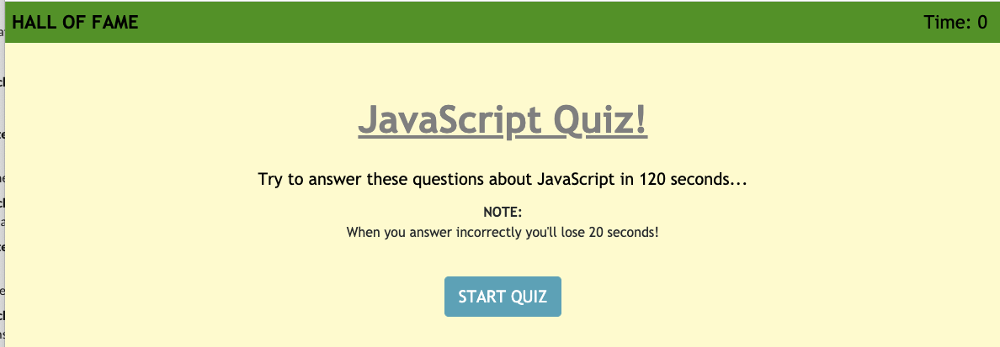
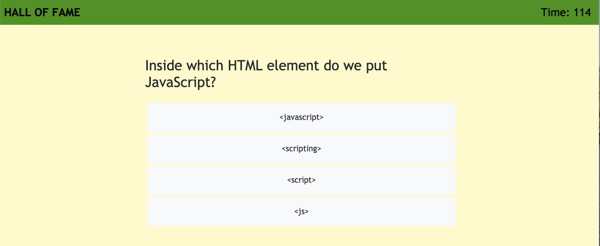
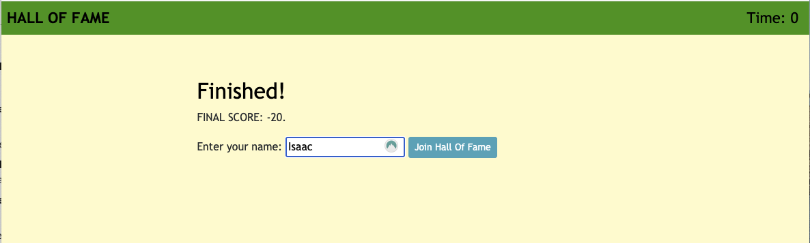
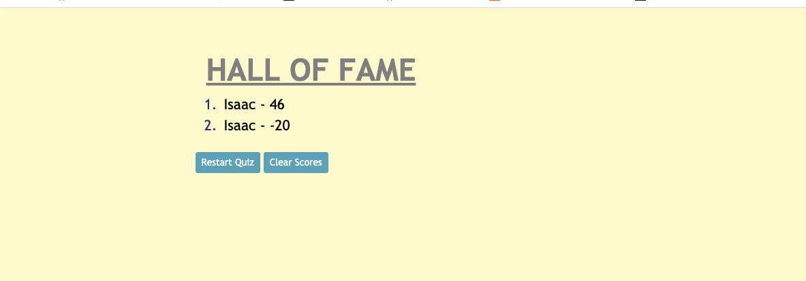

# 04 Web APIs: Code Quiz

## User Story

```
I created a timed quiz on JavaScript fundamentals that stores high scores.
```
## Deployed Link


[Deployed link](https://idallas93.github.io/Javascript-Quiz/ "Javascript Quiz")


## Description of the application

```
Includes clickable start button that starts a timer and presents a question
WHEN the user answers a question
THEN the user is presented with another question
WHEN the user answers a question incorrectly
THEN time is subtracted from the clock
WHEN all questions are answered or the timer reaches 0
THEN the game is over
WHEN the game is over
THEN the user can save their initials and score
```


## Images of homeowork web application

The following images show the application functionality:
### Home page

### Example of a quiz question in action

### Example of a final score

### Example of the hall of fame 



